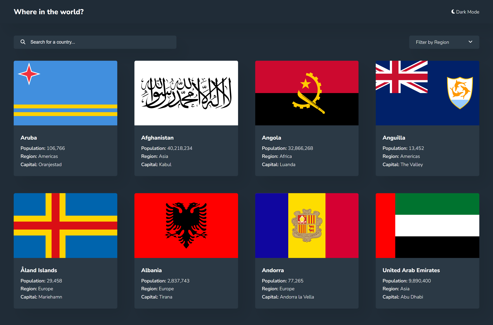

# Frontend Mentor - REST Countries API with color theme switcher solution

This is a solution to the [REST Countries API with color theme switcher challenge on Frontend Mentor](https://www.frontendmentor.io/challenges/rest-countries-api-with-color-theme-switcher-5cacc469fec04111f7b848ca). Frontend Mentor challenges help you improve your coding skills by building realistic projects. 

## Table of contents

- [Overview](#overview)
  - [The challenge](#the-challenge)
  - [Screenshot](#screenshot)
  - [Links](#links)
- [My process](#my-process)
  - [Built with](#built-with)
  - [Useful Resources](#useful-resources)
- [Author](#author)

## Overview

### The challenge

Users should be able to:

- See all countries from the API on the homepage
- Search for a country using an `input` field
- Filter countries by region
- Click on a country to see more detailed information on a separate page
- Click through to the border countries on the detail page
- Toggle the color scheme between light and dark mode *(optional)*

### Screenshot

### Links

- Solution URL: (https://your-solution-url.com)
- Live Site URL: (https://vue-rest-countries-api-opg.netlify.app/)

## My process

### Built with

- Semantic HTML5 markup
- CSS/SCSS
  - Flexbox
  - CSS Grid
- JavaScript
  - [Vue](https://vuejs.org//) - JS library
  - JSON
- API [Rest Countries](https://restcountries.com/)
- [FontAwesome](https://fontawesome.com/icons?d=gallery)

### Useful Resources

- [Sort JSON](https://community.dronahq.com/t/sort-json-response/1082)

## Author

- Frontend Mentor - https://www.frontendmentor.io/profile/omar-p-graham
- LinkedIn - https://www.linkedin.com/in/omar-p-graham/